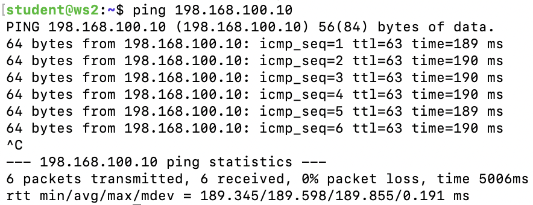
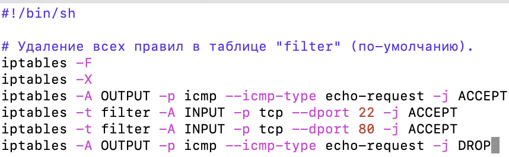
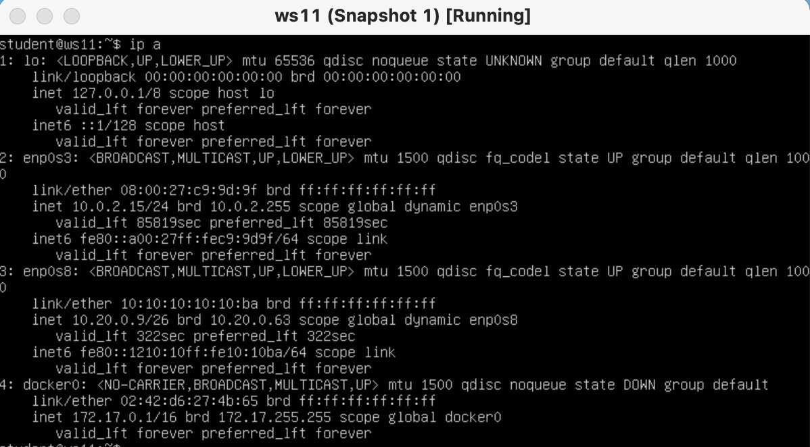

# Linux Network
## Part 1. Инструмент ipcalc

> Поднял виртуальную машину ws1.
---
### 1.1 Сети и маска
1. Адрес сети 192.167.38.54/13 (11000000.10100111.00100110.00110110)
    - 192.160.0.0
2. Перевод маски 
    - 255.255.255.0 в префиксную и двоичную запись
    - /24
    - 11111111.11111111.11111111.00000000
    ---
    - /15 в обычную и двоичную
    - 	255.254.0.0
    - 11111111.11111110.00000000.00000000
    ---
    - 11111111.11111111.11111111.11110000 в обычную и префиксную
    - 255.255.255.240
    - /28
3. Минимальный и максимальный хост в сети 12.167.38.4 при масках:
    - /8
    - 12.0.0.1 / 12.255.255.254
    ---
    - 11111111.11111111.00000000.00000000
    - 12.167.0.1 / 12.167.255.254
    ---
    - 255.255.254.0
    - 12.166.0.1 / 12.167.255.254
    ---
    - /4
    - 0.0.0.1 / 15.255.255.254
### 1.2. localhost
- Рабочии ip - 127.0.0.2, 127.1.0.1
### 1.3. Диапазоны и сегменты сетей
1. какие из перечисленных IP можно использовать в качестве публичного, а какие только в качестве частных: 
    - public: 134.43.0.2, 172.0.2.1, 192.172.0.1, 172.68.0.2, 192.169.168.1
    - private: 10.0.0.45, 10.10.10.10, 172.16.255.255, 172.20.250.4, 192.168.4.2
2. какие из перечисленных IP адресов шлюза возможны у сети 10.10.0.0/18:
    - 10.10.0.2, 10.10.10.10, 10.10.1.255
## Part 2. Статическая маршрутизация между двумя машинами

> Поднял виртуальную машину ws2.
---


> Существующие сетевые интерфейсы на обеих машинах.
---


> Прописал статические ip и маску для обеих машин.
---


> Применил сетевые настройки.
---
### 2.1. Добавление статического маршрута вручную


> Добавил статический маршрут и проверил соединение.
---
### 2.2. Добавление статического маршрута с сохранением


> Добавил статический маршрут.
---


> Принял сетевые настройки и проверил соединение.
## Part 3. Утилита iperf3
### 3.1. Скорость соединения
> Перевести и записать в отчёт:
- 8 Mbps == 1 MB/s, 100 MB/s == 800000 Kbps, 1 Gbps == 100000 Mbps
### 3.2. Утилита iperf3
```
sudo apt install iperf3 (Установил на каждую машину утилиту)
```


> На первой машину запустил сервер, на второй проверил скорость
## Part 4. Сетевой экран
### 4.1. Утилита iptables


> Содержимое файла /etc/firewall для каждой машины.
---


> Даем права на исполнение и запускаем скрипты.
---
> На машину ws1 можно получить доступ, а ws1 не может получить доступ к ws2.
---
### 4.2. Утилита nmap

> Проверяем что машина не пингуется и проверяем что она в сети.
---
## Part 5. Статическая маршрутизация сети
### 5.1. Настройка адресов машин


> Настроил конфигурации машин в etc/netplan/00-installer-config.yaml согласно сети на рисунке.
---


> Проверил правильность адресов машин и соединение между ними.
---
### 5.2. Включение переадресации IP-адресов.


> Задал временную переадресацию.
---


> Прописал адресацию на постоянной основе
---
### 5.3. Установка маршрута по-умолчанию


> Настроил маршрут по-умолчанию (шлюз) для рабочих станций.
---


> Принял настройки
---


> Пропинговал с ws11 роутер r2
---
### 5.4. Добавление статических маршрутов


> Прописал статические маршруты для r1 and r2.
---


> Принял настройки на r1 and r2.
---

> - Таблица маршрутизации.
> - Хотя 0.0.0.0 является допустимым синтаксисом адреса, клиентское устройство, использующее его в качестве исходного IP-адреса, не может взаимодействовать с другими устройствами через IP-сеть.
---
### 5.5. Построение списка маршрутизаторов


> Построение маршрута и проверка получения пакетов.
---
> Принцип работы traceroute:
> - Отправляется IP-пакет на указанный узел со значением поля TTL=1. (TTL - количество переходов)
> - Первый маршрутизатор на пути пакета уменьшает TTL и уничтожает пакет.
> - Маршрутизатор отправляет ICMP уведомление что пакет уничтожен.
> - Утилита Tracert извлекает из ICMP пакета IP-адрес маршрутизатора измеряет потраченное время на прохождение пакета до маршрутизатора.
> - В консоль выводится IP-адрес первого маршрутизатора.
> - Снова отправляется IP пакет на указанный узел, но с TTL=2
> - Пакет дропается на втором промежуточном маршрутизаторе.
> - Процедура повторяется до тех пор, пока не придёт ответ от узла назначения.
---
### 5.6. Использование протокола ICMP при маршрутизации


> Пропинговал несуществующий ip и анализ трафика на r1.
---
## Part 6. Динамическая настройка IP с помощью DHCP
```
sudo ip link set enp0s8/enp0s9 down/up (Отключаем маршрутизацию для доступа в интернет)
sudo apt install isc-dhcp-server (Устанавливаем DHCP сервер.)
```

> Измененный dhcpd.conf.
---

> resol.conf.
---

> Перезагрузил службу DHCP.
---

> Получил новый ip и пропинговал ws22.
---

> Прописал macaddress for ws11.
---

> Измененный dhcpd.conf r1.
---

> resol.conf r1.
---

> Перезагрузил службу DHCP r1.
---

> Получил новый ip и прописал macaddress.
---

> До смены ip ws21.
---

> Запросил с ws21 обновление ip адреса.
```
sudo dhclient -r enp0s8 (Удалил ip для enp0s8)
sudo dhclient enp0s8 (Запросил новый ip)
```
---
> Опции DHCP сервера для данного пункта.
> - range – диапазон ip-адресов для раздачи клиентам
> - option routers – основной шлюз
> - option domain-name-servers – DNS-сервер
> - hardware ethernet 08:00:27:b7:69:b9 - Для задания своего macaddress.
---
## Part 7. NAT
```
sudo apt update
sudo apt install apache2
```
> Сначала обновил пакеты и установил сервер apache на ws22 и r1.
---


> Изменил порт сервера apache на ws22 и r1.
---


> Запустил сервер apache на ws22 и r1.
---

> Добавил firewall.sh и правила для r2.
---

> Проверил что с ws22 нет доступа к r1.
---

> Разрешил передачу пакетов протокола ICMP для r2.
---

> Проверил что с ws22 до r1 пакеты доходят.
---

> Добавил еще правила для firewall.sh для r2.
---


> Проверил соединения.
---
## Part 8. Дополнительно. Знакомство с SSH Tunnels


> Local TCP forwarding с ws21 до ws22.
---


> Remote TCP forwarding c ws11 до ws22.
---
> Использовал команды:
> - service apache2 start - запускает сервер apache
> - ssh -L 9999:localhost:80 10.20.0.20 - создает тунель между клиентом и сервером
> - ssh -R 9999:localhost:80 10.10.0.8 - тоже самое но в обратную сторону, используется когда у клиента нет белого ip, или имеет ОС без доступа к установке SSH сервера, скрыт за NAT или вообще закрыт доступ к нему, тогда клиент сам становится клиентом.
> - telnet 127.0.0.1 80 - все та же знакомая утилита которая слушает порты.